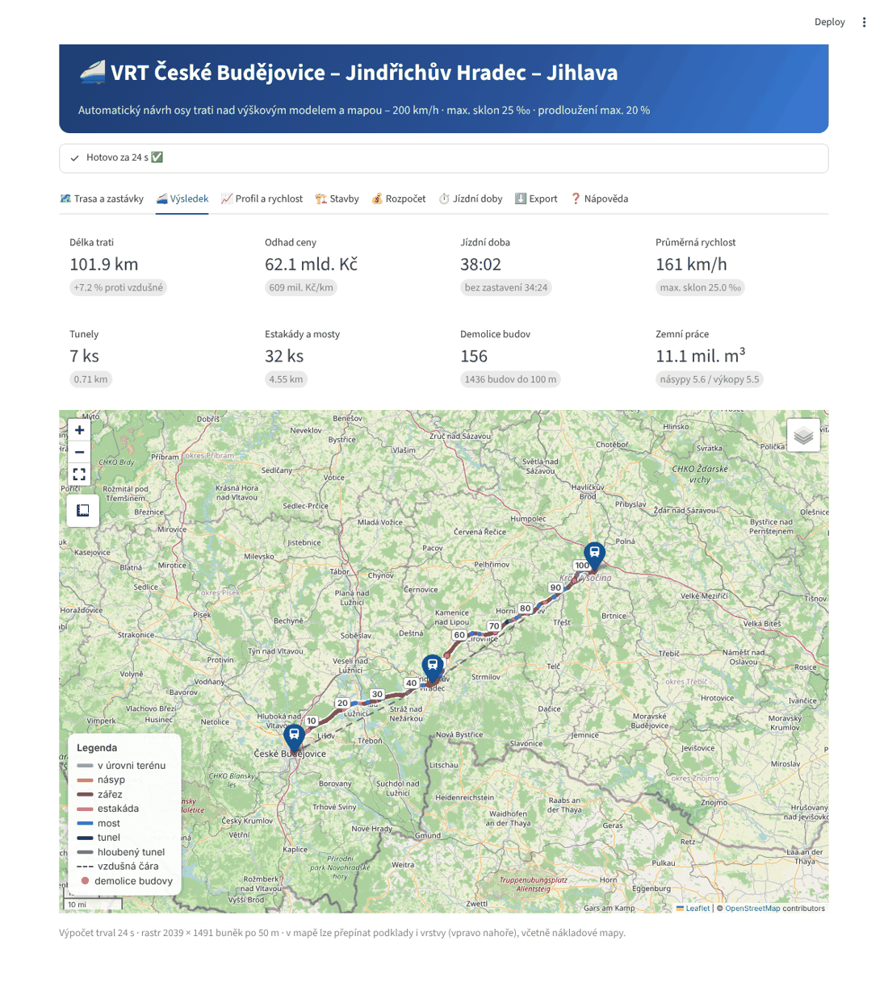
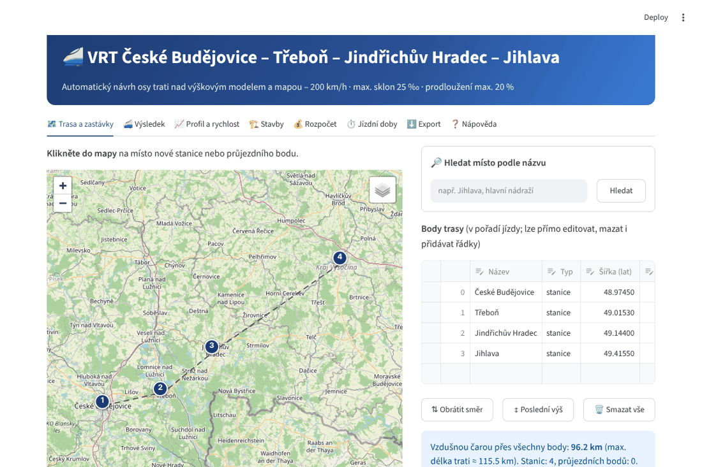
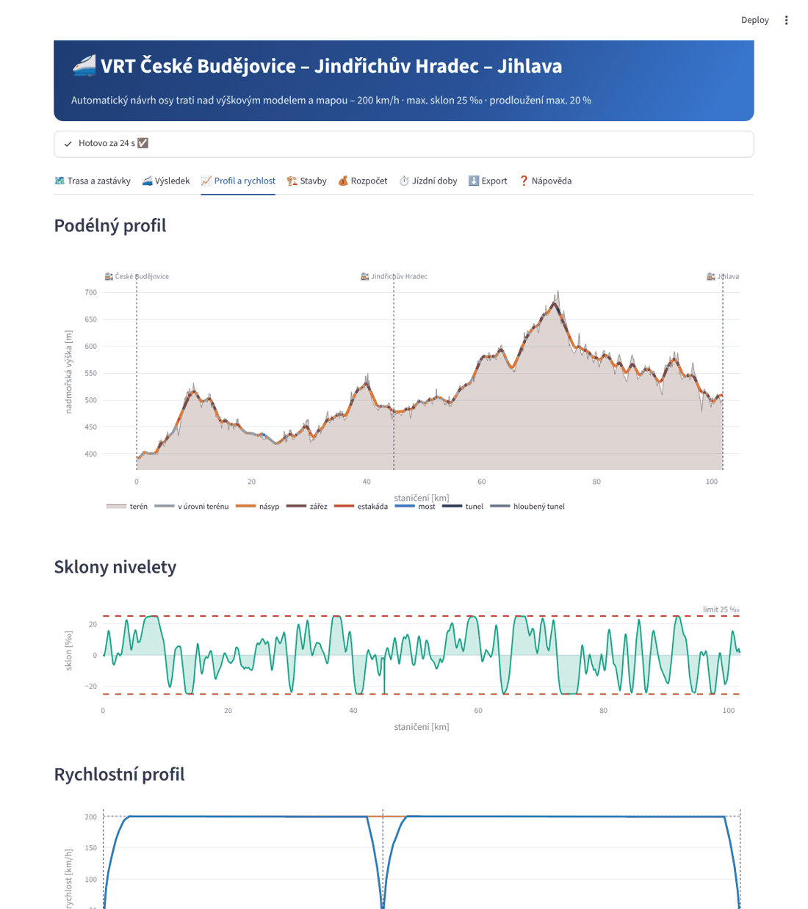
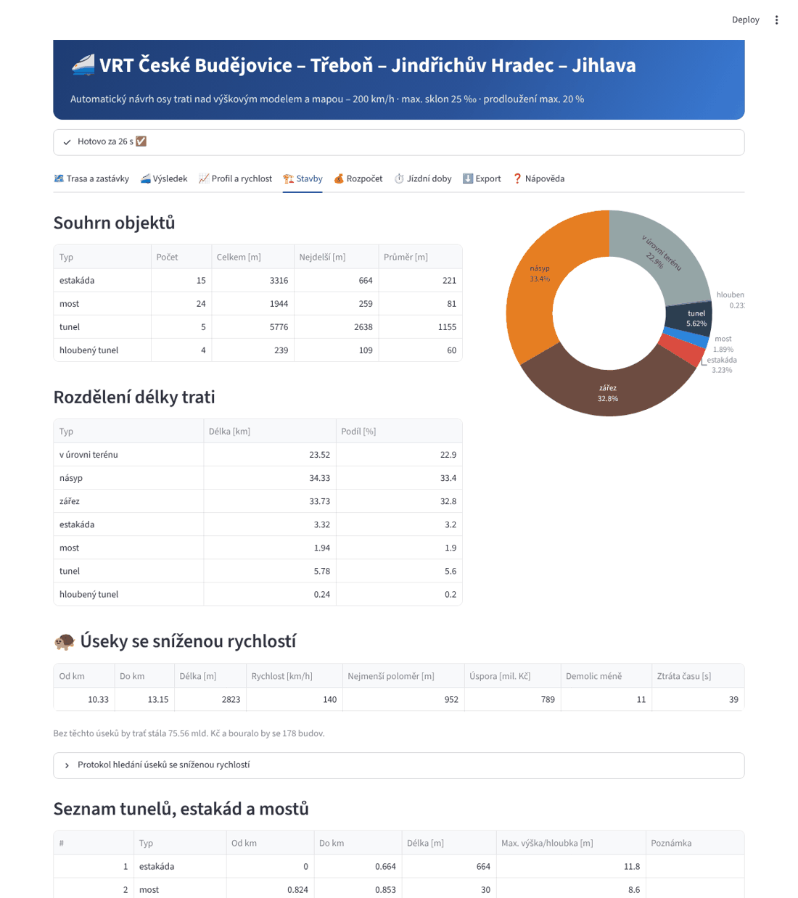

# 🚄 Plánovač tratí

**Automatický návrh osy vysokorychlostní trati nad výškovým modelem terénu a mapou OpenStreetMap.**

Zadáte stanice (např. *České Budějovice – Jindřichův Hradec – Jihlava*), návrhovou rychlost, maximální sklon,
o kolik % smí být trať delší než vzdušná čára a co je pro vás důležité (málo tunelů a estakád, nebourat domy,
vyhnout se vesnicím bez zastávky…). Program sám stáhne výškový model a mapová data, **najde optimální trasu**,
vloží oblouky, navrhne niveletu a spočítá:

- 🗺️ **interaktivní mapu** trasy obarvenou podle typu stavby (násyp, zářez, estakáda, most, tunel),
- 🏗️ **statistiku staveb** – kolik a jak dlouhých tunelů, estakád a mostů, objemy zemních prací, demolice budov,
  křížení silnic a železnic, obce u trati, průchod chráněnými územími,
- 💰 **orientační cenu** po položkách,
- ⏱️ **jízdní doby** a jízdní řád (simulace jízdy vlaku), rychlostní profil,
- 📈 **podélný profil** a sklony,
- ⬇️ export do **HTML reportu, GeoJSON, KML (Google Earth), CSV (Excel)**.



> ⚠️ Jde o **koncepční studii** pro porovnání variant, ne o projektovou dokumentaci. Ceny jsou orientační.

---

## ⚡ Instalace a spuštění – Windows

**Potřebujete:** [Python 3.10 nebo novější](https://www.python.org/downloads/) – při instalaci zaškrtněte
**„Add python.exe to PATH“**. Volitelně [Git](https://git-scm.com/download/win) (pro snadné aktualizace).

### 1. Stažení

S Gitem (doporučeno) – v příkazovém řádku (`Win + R` → `cmd`):

```bat
cd %USERPROFILE%\Documents
git clone https://github.com/tomasraketak/planovactrati.git
cd planovactrati
```

Bez Gitu: na GitHubu klikněte na **Code → Download ZIP**, rozbalte a otevřete složku.

### 2. Instalace (jednou)

```bat
install.bat
```
(nebo dvojklik na `install.bat`) – vytvoří virtuální prostředí `.venv` a nainstaluje knihovny (několik minut).

### 3. Spuštění

```bat
run.bat
```
(nebo dvojklik) – v prohlížeči se otevře aplikace na adrese <http://localhost:8501>. Ukončení: zavřít okno
příkazového řádku nebo `Ctrl + C`.

### 4. Aktualizace na novou verzi

```bat
update.bat
```
(stáhne novou verzi přes `git pull` a aktualizuje knihovny).

<details>
<summary>Ruční instalace bez .bat skriptů (cmd)</summary>

```bat
py -3 -m venv .venv
.venv\Scripts\activate
python -m pip install --upgrade pip
pip install -r requirements.txt
streamlit run app.py
```
</details>

## 🐧 Linux / 🍎 macOS

```bash
git clone https://github.com/tomasraketak/planovactrati.git
cd planovactrati
./install.sh      # instalace
./run.sh          # spuštění GUI
./update.sh       # aktualizace
```

---

## 🧭 Jak se to používá

1. Vlevo v **📁 Projekt** vyberte `cb_jh_jihlava` (přednastaveno) nebo `demo` (bez internetu, hotovo za pár
   sekund) a klikněte **Načíst projekt**.
2. Na kartě **🗺️ Trasa a zastávky** klikáním do mapy přidávejte **stanice** (vlak zastavuje, trať smí do města)
   a **průjezdní body** (trasa tudy musí vést). Body lze i vyhledat podle názvu nebo upravit v tabulce.
3. Vlevo nastavte **rychlost, max. sklon, max. prodloužení proti vzdušné čáře**, priority a ceny.
4. Klikněte **🚀 Navrhnout trať**. První výpočet v nové oblasti stahuje data (výškový model ~40 MB na
   1°×1°, OpenStreetMap) – může trvat několik minut. Další výpočty už jedou z cache za desítky sekund.
5. Prohlédněte výsledky na kartách **Výsledek, Profil, Stavby, Rozpočet, Jízdní doby** a stáhněte **Export**.



Podrobný návod: **[docs/NAVOD.md](docs/NAVOD.md)** (je i přímo v aplikaci na kartě ❓ Nápověda).

| | |
|---|---|
|  |  |

### Hlavní nastavitelné parametry

| Parametr | Výchozí | Poznámka |
|---|---|---|
| Návrhová rychlost | 200 km/h | určuje min. poloměr oblouku R = 11,8·V²/(D+I) |
| Max. sklon | 25 ‰ | osobní VRT 25–35 ‰, smíšený provoz 12,5–18 ‰ |
| Max. prodloužení proti vzdušné čáře | 20 % | pro každý úsek mezi sousedními body |
| Priority | 1,0 | obce, domy, tunely/estakády, voda, chráněná území, délka |
| Jednotkové ceny | ČR ~2025 | tunel 1,3 mld./km, estakáda 650 mil./km, … |
| Vlak | 420 t, 8,8 MW | VRT jednotka, pobyt ve stanici 2 min |
| Rozlišení | 50 m | 100 m rychle / 25 m detail |

## 💻 Příkazová řádka

```bat
planovac.bat run projekty\cb_jh_jihlava.yaml              :: spočítá a uloží výstupy do vystupy\
planovac.bat run projekty\demo.yaml -o vystupy\demo       :: vlastní výstupní složka
planovac.bat run projekty\cb_jh_jihlava.yaml --rozliseni 100
planovac.bat novy projekty\moje_trat.yaml                 :: šablona nového projektu
```
(Linux/macOS: `./planovac.sh run projekty/demo.yaml`.) Projekt je čitelný YAML soubor – lze ho upravit
i v Poznámkovém bloku:

```yaml
nazev: VRT České Budějovice – Jindřichův Hradec – Jihlava
body:
- {nazev: České Budějovice, lat: 48.9745, lon: 14.488, typ: stanice}
- {nazev: Jindřichův Hradec, lat: 49.144, lon: 15.003, typ: stanice}
- {nazev: Jihlava, lat: 49.4155, lon: 15.602, typ: stanice}
navrh:
  rychlost_kmh: 200
  max_sklon_promile: 25
  max_prodlouzeni_pct: 20
vahy: {obce: 1.0, budovy: 1.0, teren: 1.0, voda: 1.0, chranena_uzemi: 1.0, delka: 1.0}
```

---

## 🔬 Jak to funguje

1. **Data** – výškový model Copernicus GLO-30 (AWS Open Data) a OpenStreetMap (Overpass API): zástavba, budovy,
   vody, silnice, železnice, chráněná území. Vše se ukládá do `data/cache/`.
2. **Nákladová mapa** – každé buňce rastru se přiřadí „cena za metr trati“ podle zástavby, budov, členitosti terénu,
   vody a ochrany přírody (s vahami z GUI). Okolí stanic se nepenalizuje.
3. **Koridor** – Dijkstrův algoritmus najde nejlevnější cestu v elipse povoleného prodloužení; pokud je trasa
   delší než limit, přitlačí se na délku (Lagrangeův multiplikátor).
4. **Oblouky** – lomená čára → přímé + kružnicové oblouky s R ≥ R_min, stanice na přímé.
5. **Niveleta** – dynamické programování najde globálně nejlevnější výškové vedení (násyp / zářez / estakáda /
   tunel / most) při dodržení max. sklonu.
6. **Analýza** – klasifikace staveb, demolice, křížení, rozpočet, simulace jízdy vlaku.

Podrobně: **[docs/ALGORITMUS.md](docs/ALGORITMUS.md)** · Upřesněné zadání a vývojové podmínky:
**[docs/ZADANI.md](docs/ZADANI.md)**

## 📂 Struktura projektu

```
app.py                 webové GUI (Streamlit)
planovac/              výpočetní jádro
  config.py            parametry projektu (YAML)
  dem.py, osm.py       stahování výškového modelu a OSM
  costsurface.py       nákladová mapa
  corridor.py          hledání koridoru
  horizontal.py        přímé a oblouky
  vertical.py          niveleta (dynamické programování)
  structures.py        tunely, estakády, mosty, demolice, křížení
  costs.py             rozpočet
  traction.py          simulace jízdy, jízdní doby
  report.py            mapa, grafy, HTML report, exporty
  pipeline.py, cli.py  orchestrace a příkazová řádka
projekty/              uložené projekty (YAML)
docs/                  dokumentace
tests/                 automatické testy (pytest)
install/run/update.bat|.sh, planovac.bat|.sh
```

## 🧪 Testy (pro vývojáře)

```bat
.venv\Scripts\pip install -r requirements-dev.txt
.venv\Scripts\python -m pytest
```
Testy běží bez internetu na syntetickém terénu.

## ❓ Časté problémy

| Problém | Řešení |
|---|---|
| `Python nebyl nalezen` | Nainstalujte Python z python.org a zaškrtněte *Add python.exe to PATH*, pak znovu `install.bat`. |
| Varování *Overpass API nedostupné* | Servery OSM bývají přetížené. Výpočet doběhne bez dané vrstvy; zopakujte ho později (úspěšně stažená data zůstávají v cache). |
| Výpočet je pomalý | Zvolte rozlišení 100 m, vypněte *Stahovat budovy v celé oblasti*, nebo zmenšete *max. prodloužení* (menší oblast). |
| Málo paměti | Velké oblasti (stovky km) počítejte na 100 m. |
| Chci přesnější terén | Stáhněte DMR 5G (ČÚZK) jako GeoTIFF a zadejte cestu v *Výpočet a data → Vlastní DEM*. |
| Smazat stažená data | Smažte složku `data\cache`. |

## 📜 Licence a data

Kód: MIT. Data: Copernicus DEM GLO-30 © DLR e.V. 2010–2014 a © Airbus Defence and Space GmbH 2014–2018,
poskytnuto v rámci programu Copernicus; © přispěvatelé OpenStreetMap (ODbL); vyhledávání Nominatim.
